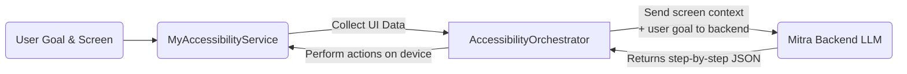

# Mitra AI Android

Mitra AI Android is an application leveraging Android’s AccessibilityService to capture on-screen UI data, send it (along with user goals) to a backend orchestrator powered by AI/LLMs, and automatically trigger interactions in other apps (taps, text entries, scrolling, etc.). 

--------------------------------------------------------------------------------
## Table of Contents
1. Overview  
2. Features  
3. Architecture  
4. Getting Started  
5. Building & Running  
6. Usage Flow  
7. Configuration  
8. Troubleshooting & Tips  
9. License  

--------------------------------------------------------------------------------
## 1. Overview
Mitra AI Android implements a “Sense–Think–Act” loop:  
- Sense: The app’s AccessibilityService collects real-time UI context from whatever is on-screen.  
- Think: Collected context is sent to a backend orchestrator (e.g., a GPT-powered service) to determine a plan of actions.  
- Act: Mitra AI executes the returned actions (clicking buttons, filling text, etc.) automatically on the device.

This approach allows you to automate app interactions, helping users accomplish tasks across different apps with minimal manual effort.

--------------------------------------------------------------------------------
## 2. Features
- Custom AccessibilityService  
  - Listens for UI changes across the device’s foreground apps.  
  - Aggregates label, text, resource ID information for each visible element.

- Network Orchestrator Integration (HTTP/Retrofit)  
  - Sends screen data and user goals to the “Mitra Backend” or other orchestrator service.  
  - Receives structured JSON instructions representing the next steps to perform.

- Automatic UI Actions  
  - Programmatically taps buttons, fills text, or scrolls to specific elements—replicating user behavior.

- Clean Project Structure  
  - Accessibility logic is isolated in MyAccessibilityService.  
  - Networking logic is handled in OrchestratorApi.  
  - Data models (ScreenElement, Step Instructions) kept in data/.

--------------------------------------------------------------------------------
## 3. Architecture



1. (A) The user navigates within any app or enters a high-level goal in Mitra AI Android.  
2. (B) MyAccessibilityService “senses” the screen’s UI elements.  
3. (D) AccessibilityOrchestrator packages screen elements + user goal → calls the backend.  
4. (E) The Mitra backend (powered by GPT or another LLM) returns step-by-step actions.  
5. The app “acts” on these actions via Accessibility (clicking buttons, filling text, etc.).

--------------------------------------------------------------------------------
## 4. Getting Started

### Prerequisites
- Android Studio (Arctic Fox or newer).  
- An Android device or emulator (API level 21+).  
- A backend orchestrator service (e.g., Mitra Backend) that processes screen context and returns a plan.

### Repository Structure
```
MitraAIAndroid/
├── .gitignore
├── README.md
├── build.gradle
├── settings.gradle
├── gradle/
│   └── wrapper/
├── app/
│   ├── build.gradle
│   └── src/
│       ├── main/
│       │   ├── AndroidManifest.xml
│       │   ├── java/
│       │   │   └── com/
│       │   │       └── example/
│       │   │           └── mitraaiapp/
│       │   │               ├── MainActivity.kt
│       │   │               ├── network/
│       │   │               │   └── OrchestratorApi.kt
│       │   │               ├── accessibility/
│       │   │               │   ├── MyAccessibilityService.kt
│       │   │               │   └── AccessibilityOrchestrator.kt
│       │   │               ├── data/
│       │   │               │   └── ScreenContext.kt
│       │   │               ├── ui/ (optional)
│       │   │               └── util/ (optional)
│       │   └── res/
│       │       ├── layout/
│       │       ├── xml/
│       │       │   └── accessibility_service_config.xml
│       │       └── values/
│       ├── test/
│       └── androidTest/
└── ...
```

--------------------------------------------------------------------------------
## 5. Building & Running

1. **Clone This Repository**  
   ```
   git clone https://github.com/YourOrg/MitraAIAndroid.git
   cd MitraAIAndroid
   ```

2. **Open in Android Studio**  
   - File → Open → select MitraAIAndroid folder.

3. **Configure Orchestrator URL**  
   - In OrchestratorApi.kt, set the BASE_URL to your Mitra Backend’s endpoint.

4. **Build & Run**  
   - Use Android Studio’s “Run” button to build and deploy the app on an emulator or device.  
   - Alternatively, from terminal:  
     ```
     ./gradlew assembleDebug
     ./gradlew installDebug
     ```

--------------------------------------------------------------------------------
## 6. Usage Flow

1. **User Installs & Opens Mitra AI Android**  
   - The app may prompt for user’s high-level goal or might rely on prompts in the backend.

2. **Grant Accessibility Permission**  
   - Go to “Settings → Accessibility → Mitra AI Android” and enable.  
   - This permission is crucial to receive UI events.

3. **Automated Interaction**  
   - As the user navigates in any other app, MyAccessibilityService collects the visible UI elements.  
   - The service sends the data along with the user’s intended goal to the Mitra backend.  
   - The backend returns a sequence of actions:
     ```json
     {
       "steps": [
         { "action": "tap",  "target": { "resource_id": "search_button" } },
         { "action": "fill", "target": { "resource_id": "from_input", "text": "NYC" } },
         ...
       ]
     }
     ```
   - Mitra AI Android executes these actions on the screen, effectively automating the workflow.

--------------------------------------------------------------------------------
## 7. Configuration

- **Accessibility Service**  
  - `accessibility_service_config.xml` defines event types, feedback type, etc.  
  - **MyAccessibilityService.kt**: the main entry point for receiving UI events and performing actions.

- **Network**  
  - `OrchestratorApi.kt` uses Retrofit (or another HTTP client) to communicate with the orchestrator.  
  - Update the `BASE_URL` to match your environment (development, staging, production).

- **Build Variants**  
  - You can create multiple build flavors for different environments (e.g., dev vs. prod) in your `app/build.gradle`.

--------------------------------------------------------------------------------
## 8. Troubleshooting & Tips

- **Accessibility Not Triggering**  
  - Make sure the service is Enabled. If in doubt, re-check “Accessibility → Mitra AI Android → Enable.”

- **Resource ID/Views Not Found**  
  - Some apps do not expose resource IDs or text. Investigate alternative matching methods (by text, contentDescription, etc.).

- **Advanced AI Logic**  
  - If your orchestrator sends complex step sequences or requires user input at certain steps, handle partial automation, then re-sense the screen.

- **User Privacy & Security**  
  - Accessibility can see potentially sensitive data. Explain clearly in your privacy policy. Handle data responsibly.

- **Investigate Logs**  
  - Use Logcat to watch for AccessibilityEvent logs. Confirm your service sees the events and can act on them.

--------------------------------------------------------------------------------
## 9. License

[MIT License](./LICENSE) (or your chosen license). Under this license, you are free to modify, distribute, and use this code, subject to any obligations stated in the LICENSE file.

---

Mitra AI Android – bridging the power of AI with Android Accessibility to deliver seamless app automation and user-friendly experiences. Enjoy developing and extending the possibilities!
