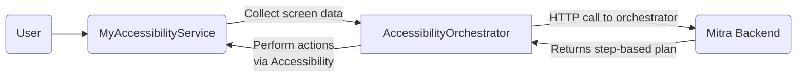

# Mitra AI Android

Mitra AI Android leverages Android’s AccessibilityService to capture on-screen UI data, send it (along with user goals) to a backend orchestrator powered by AI/LLMs, and automatically trigger interactions in other apps (taps, text fields, scrolling, etc.).

---

## Table of Contents
- [Overview](#overview)  
- [Features](#features)  
- [Architecture](#architecture)  
- [Getting Started](#getting-started)  
- [Building & Running](#building--running)  
- [Usage Flow](#usage-flow)  
- [Configuration](#configuration)  
- [Troubleshooting & Tips](#troubleshooting--tips)  
- [License](#license)

---

## Overview
Mitra AI Android implements a “Sense–Think–Act” cycle:
1. **Sense**: A custom AccessibilityService collects real-time UI context from any foreground app.  
2. **Think**: This context, plus a user’s goal, is sent to a backend AI orchestrator (e.g., GPT-based) that determines the best step-by-step actions.  
3. **Act**: The app automatically executes these instructions through Accessibility, performing clicks, text filling, or scrolling.

This model offers powerful automation to help users perform complex tasks across apps with minimal manual effort.

---

## Features
- **Custom AccessibilityService**:  
  - Subscribes to UI events (window changes, clicks).  
  - Gathers resource IDs, text content, node hierarchies.

- **Orchestrator API Integration**:  
  - Communicates with the “Mitra Backend” or another LLM-based service.  
  - Sends screen context and user goals in JSON. Receives structured instructions in return.

- **Automated UI Actions**:  
  - Taps, text fills, scrolling—executed without manual user interaction.  
  - Ideal for hands-free tasks or advanced automation flows.

- **Modular Project Structure**:  
  - Accessibility logic in MyAccessibilityService.  
  - Networking in OrchestratorApi.  
  - Data models (ScreenElement, etc.) in data/.

---

## Architecture


- (A) The user interacts with or navigates to a target app.  
- (B) MyAccessibilityService observes the UI changes.  
- (D) It then sends the observed data and user goal to the Mitra Backend (E).  
- (E) The backend returns structured actions.  
- (D) The app executes them on-screen via Accessibility actions (click, fill, etc.).

---

## Getting Started
### Prerequisites
- Android Studio (Arctic Fox or newer recommended).  
- An Android device or emulator running at least API 21+.  
- A functioning orchestrator backend (e.g., “Mitra Backend”) that can receive screen data + user goals, then return automation instructions.

### Repository Structure
```
MitraAIAndroid/
├── .gitignore
├── README.md
├── build.gradle
├── settings.gradle
├── gradle/
│   └── wrapper/
├── app/
│   ├── build.gradle
│   └── src/
│       ├── main/
│       │   ├── AndroidManifest.xml
│       │   ├── java/
│       │   │   └── com/example/mitraaiapp/
│       │   │       ├── MainActivity.kt
│       │   │       ├── network/
│       │   │       │   └── OrchestratorApi.kt
│       │   │       ├── accessibility/
│       │   │       │   ├── MyAccessibilityService.kt
│       │   │       │   └── AccessibilityOrchestrator.kt
│       │   │       ├── data/
│       │   │       │   └── ScreenContext.kt
│       │   │       ├── ui/ (optional features/UI)
│       │   │       └── util/ (utils/helpers)
│       │   └── res/
│       │       ├── layout/
│       │       ├── xml/
│       │       │   └── accessibility_service_config.xml
│       │       └── values/
│       ├── test/
│       └── androidTest/
└── ...
```

---

## Building & Running
1. **Clone the Repo**  
   ```bash
   git clone https://github.com/YourOrg/MitraAIAndroid.git
   cd MitraAIAndroid
   ```

2. **Open in Android Studio**  
   - File → Open → select MitraAIAndroid folder.

3. **Configure the Orchestrator URL**  
   - In OrchestratorApi.kt, set the BASE_URL to point to your Mitra Backend environment.

4. **Build & Run**  
   - Use Android Studio’s “Run” button or:
   ```bash
   ./gradlew assembleDebug
   ./gradlew installDebug
   ```

---

## Usage Flow
1. **Enable Accessibility**  
   - On your device: Settings → Accessibility → Mitra AI Android → toggle on.

2. **Initiate a Task**  
   - The user might provide a goal like “Book a flight from NYC to London.”  
   - Alternatively, Mitra AI might detect a change in the current app to infer user intent.

3. **Screen Data Collection**  
   - MyAccessibilityService gathers the visible UI elements—resource IDs, text fields, etc.

4. **Send to Backend**  
   - The “AccessibilityOrchestrator” compiles screen data + user goal → calls the orchestrator API.

5. **Receive Action Steps**  
   - Example JSON from the backend:
     ```json
     {
       "steps": [
         { "action": "fill", "target": { "resource_id": "from_input", "text": "NYC" } },
         { "action": "fill", "target": { "resource_id": "to_input", "text": "London" } },
         { "action": "tap", "target": { "resource_id": "search_button" } }
       ]
     }
     ```
   - Mitra AI Android executes each step via Accessibility actions on the target app.

---

## Configuration
- **Accessibility Service**  
  - Declared in `accessibility_service_config.xml` and `MyAccessibilityService.kt`.  
  - `android:accessibilityEventTypes` can define which events you track (click, window changes, etc.).

- **HTTP Networking**  
  - OrchestratorApi uses Retrofit (or any HTTP client of your choice).  
  - For advanced usage, add interceptors, logging, or authentication tokens.

- **Build Variants**  
  - You can create multiple productFlavors (dev/prod) for different backend endpoints in `app/build.gradle`.

---

## Troubleshooting & Tips
- **Service Not Triggering?**  
  - Confirm Accessibility is enabled. Check logs for any initialization errors.

- **Elements Not Found**  
  - Some apps do not expose resource IDs. Use text matching or content descriptions as a fallback.

- **Large or Dynamic UIs**  
  - Performance may degrade if you re-scan the entire view hierarchy frequently. Optimize or filter out unneeded views.

- **User Privacy & Security**  
  - Accessibility can read private information. Provide disclaimers and handle data securely.

- **Logcat Debugging**  
  - Insert logs in `onAccessibilityEvent()` and your network calls to see real-time activity.  

---

## License
Use any license that fits your project. For example:  
[MIT License](./LICENSE)

You are free to modify, distribute, and use the code, subject to the License terms.

---

Mitra AI Android – supercharging app interactions through Accessibility, AI-driven planning, and hands-free automation. Enjoy developing and extending the power of Mitra! 
